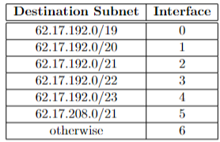

# Class test notes

Packet at each layer:
- Transport - TCP/UDP Segment
- Network - IP Datagram
- Link - Frame

## *Difference between forwarding and routing*

### Forwarding

Move packets from input link to appropriate router output link.

### Routing

Determine route taken by packet through nodes in a network.

## Router architecture


- Green = Line Terminator
- Blue = link layer protocol
- red = lookup forwarding queuing

## *Different switching fabrics*

### Switching via memory

Shared pool of memory, ports read and write from shared pool.
- under direct control of CPU
- Speed limited by the memory bandwidth

### Switching via bus

Packet sent down shared bus between outputs and is checked at every output link if it is needed and is dropped by the link if it is not.
- limited by the bus bandwidth

### Intercommunication Network
Crossbar of links between switches that interconnect to other nets allowing us to exploit parallelism. Datagram is fragmented and sent through the net and reassembled at the end.

## Packet loss in input ports
- Buffer overflow - too packets in buffer so some can be dropped at random
- Head-of-the-line queuing which is datagram at head of queue prevents other datagrams moving forward in the queue

## Packet loss in output ports
- lost in buffer when speed of fabric >transmission rate
- drops datagrams when buffer fills
- Scheduling discipline - packets may not get sent and held in buffer which increases chance of getting dropped

## Sending datagram with an MTU
```
3100 Byte datagram
MTU of 320 Bytes


Fragments generated?

TCP header of 20 bytes per frag and datagram

3100 - 20 = 3080 Bytes of data
320 - 20 = 300 bytes of data per fragment

3080 / 300 = 10.266666667 but we cannot have 0.266666667 of a fragment so take ceiling

11 Fragments
```

## IPv4 datagram structure

```
01000101 00000000 00000000 11111010
00001010 01111110 01000000 00000000
10000000 00000110 10110101 10100010
10101000 00100100 00000100 00010100
11001000 00101001 00000100 00011000
```

Each line of binary above corresponds to the blocks below.


## IPv6 datagram


## Splitting IP allocations across subnets

### Notation

In form a.b.c.d/x where x is how many bits are 1 in the subnet. This shows allocation

### *Example of question workings*

```
Given address space 223.200.0.0/20. We know IPv4 is 32 bits so we can use the last 12 
bits which gives us 12^2 = 4096.

Subnet A wants 2000 ips, subnets B and C want 100 each. Can do this by halving and 
allocating.

This is such:

for subnet A we look at the bits

we dont touch 223 or 200 but the 0, we can use half of that byte

so we can say 0000|1000 is a space of a 21 subnet saying that A has 223.200.0.0/21 
to 223.200.8.0/21 subnet.

Then apply this recursively

B and C need 22 subnets

000010|00
000011|00 range

therefore: 223.200.8.0/22 to 223.200.12.0/22 subnet.
```

## *Do routers have IP addresses? If so, how many?*

Yes, 2 - one in and 1 out

## Determining interfaces travelled through

```
H -> R -> R -> R -> R -> R -> D
```

Each R (router) uses 2 interfaces so 5\*2 = 10 and then host uses 1 and destination uses 1 so can send out and receive in. Making this (5\*2) + 2 = 12.

## Determining how many routing tables

For each node excluding destination so 6.

## Address spaces

- IPv4 = 32 bits
- IPv6 = 128 bits
- MAC address = 48 bits

## Choosing a destination subnet



Where does 62.17.193.1 go?

Well we can check using the bits

```
62.17.11000001.00000001

We cab see the that in the middle where we specify

11000001
  |||||
  01234

To get interface 5 then would be 11010000 but we dont have that 1 in the middle so 
goes to 4 as thats most specific.

 ```
## Intra-AS protocol

Must all run same protocol as all on same subnet as they're all managed by the same administrative control.

## Different protocols for inter/intra-AS

### Inter

Admin wants more control

Policy dominates the performance (need for)

### Intra

Single admin so having a policy between is less of an issue as only one person managing

Performance focused as less need for a good policy.

## CRC
```
D = 110101
G = 1011

now is 110101000

Bitwise XOR with generator

110101000
1011|||||
----|||||
01100||||
 1011||||
 ----||||
 01111|||
  1011|||
  ----|||
  01000||
   1011||
   ----||
   00110|
    0000|
    ----|
    01100
     1011
     ----
     0111

Take last 3 bits so CRC = 111
```

## Ideal multiple access protocol
- when 1 node is transmitting, gets all the bandwidth of link
- when m nodes are transmitting, transmit at average rate R/M
- simple protocol
- fully decentralized

## *What does slotted ALOHA look like?*


## Why is ARP sent in broadcast frame?

Needs to flood network to gather MAC address table.

This lets ARP then send to the correct link using MAC addresses

## Routers and switches

Routers are network layer.

Switches are link layer.

## *what is a CSMA protocol?*

Checks if current line is idle and decides if idle to transfer an entire frame and wait if there is a frame currently being transferred.

## *What's more efficient, channel partitioning or random access?*

Random is better as a frame can have entire bandwidth if it is the only one transferring on the line, its also simpler to implement and decentralized more as checking is done at nodes.

## CSMA/CA


## Forwarding Tables


Router:

|Destination Subnet|Next Router|Number of Hops|Interface|
|:---:             |:---:      | :---:        |:---:    |
|192.1.4.0/24      |-          |1             |192.1.4.40|
|192.1.6.0/24      |-          |1             |192.1.6.50|
|192.1.8.0/24      |-          |1             |192.1.8.60|

Host 192.1.8.1:

|Destination Subnet|Next Router|Number of Hops|
|:---:             |:---:      | :---:        |
|192.1.4.0/24      |192.1.8.60 |3             |
|192.1.6.0/24      |192.1.8.60 |3             |
|192.1.8.0/24      |-          |0             |

\- means it doesn't have to visit another router
