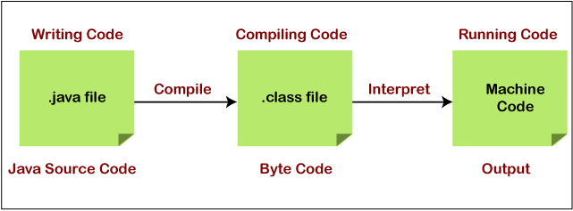

# Brief Notes For 122 Test

---

## Syntax and the JVM

Java is **both interpreted and compiled**.

The JVM interprets byte code (Java command).

Byte code binaries end in `class`.



Compiled languages are **MORE** efficient than interpreted ones.

The JVM is an **interpreter** for java bytecode.

Java comments:
- `//` -> one line comments
- multiline comments start in `/*` and end in `*/` with lines in between starting in `*`

Every statement correct in java ends in `;`.

List of java's keywords can be found [here](https://en.wikipedia.org/wiki/List_of_Java_keywords).

the source code:

```Java
public class Example{...}
```

Should always reside in a file called **Example.java** and a compiled class is called **Example.class**.

---
## Types and Variables

Each variable in java consists of **an indentifier, a type** and **a value**.

Java is 2 distinct styles of types:
- **Primitive**:
 - int, boolean, char etc..
- **Composite**:
 - String, Arrays. (Essentially it is composed of other primitive datatypes).

The two types for boolean are **true** and **false**. **THESE ARE CASE SENSITIVE**.

> Valid array: Say we have an array that has type `int[]`.

Here `{1,4,"hello", 5}` would not be a valid array where as `{1,2,3,5}` is a valid array, all data must be of same type.

Valid identifiers must be made of: *A lower case character or symbol at the start followed by a sequence of characters, numbers or special characters excluding* `.`.

Java uses the camel case naming convention ie `thisIsAVariable`.

Remember always check if syntax like semicolons or dot notation are correct and present.

Declaration in java: `double num;`

Initialisation in java: `num = 4.8;`

Both together in java: `double num = 4.8;`

---
## Methods loops and packages

The correct structure for a method:

```java
// structure
(private, public or protected) (static or blank) (return type) (args) {}

// Example

private boolean exampleMethod(int first, int second) {...}
```

Methods only have the same signature if and only if the return type is the same, the method names are the same and the arguments are of same types.

```java
// Example of same signature
public static myMethod(double x, double y, boolean b){}
public static myMethod(double y, double x, boolean b){}

// Example of not the same
public static myMethod(double x, double y, boolean b){}
public static myMethod(boolean b, double x, double y){}
```

**Void** is used as a placeholder in a method to say it will not return a value.

While loops test code **before** executing the code block.

To import libraries in java, you must use the word `import` and the classes you want from the package. Example to import an Array library we can use `import java.util.Arrays;` Which is placed above the classes it will be used in.

---
## Objects and classes

Attributes can also be called **properties** and **fields**.

How to instantiate an object (Default constructor): `Circle c = new Circle();`.

Each class can have **multiple** objects.

**New** creates a new instance of an object.

An object can refer to its own attributes no matter if the attribute is private or public but is not readable from outside of the class if **private**.

In order to access it, you would need a getter method.

A class may only have **one** default constructor but may have multiple constructors that take different arguments.

If a variable is marked as `static` then it is a constant and cannot be changed during runtime.

---
## Inheritance

To make a class a subclass of another, you use the `extends` keyword. `public class Square extends Shape{...}`.

A subclass **will not** inherit any private methods from its superclass, only public (excluding constructors) and protected.

**Protected** prevents accesses outside the object using `object.attribute` but has different semantics to public.

**Every class** in java descends from the class object.

Java doesn't support multiple inheritance.

**Overriding** a method is when the method signature in one class matches another in its super to change the outcome of the method when called with the specified object

**Overloading** is when you have two methods with the same name in the same class but have different parameters.

---
## Abstract classes and interfaces

- Abstract class:
 - can be a type
 - can have multiple subclasses
 - can have more than one super classes
 - abstract classes can be extended by other abstract classes meaning not all methods have to be concrete in a subclass of an abstract class
 - main uses you need to know: `prevents the class from being instantiated directly` and `ensures that some of the methods are overrode by subclasses`.
- Interface:
 - interfaces cannot implement other interfaces
 - but can be implemented by more than one class

---
## Exceptions

You can surround code in the keywords `try` and `catch` to handle *dangerous* code.

```java
try {
   some code
} catch {exception e} {
   handle the error
}
```

You can have specific exceptions like `IOException` or `NullPointerException`.

If you would like to handle multiple exceptions then this is what it would look like.

```java

try {
    //some IO code
} catch {IOException ioe} {
    //handle the error
} catch {Exception e} {
    //Handles any other type of error
} finally {
    // reports code finished
}
```

You **must** ensure that to catch any other errors than `Exception` is places below any specifically caugh exceptions.

There are different exceptions that are checked and unchecked.

Checked exceptions: checked at **compile-time**.

Unchecked exceptions: checked at **Run-time**.

---
## IO

These are mostly based from the questions presented in practise quiz.

Writing to Output streams only allows (arrays of) bytes.

Same with input streams reading byte-based types.

See `java.io` javadocs for info on different readers if asked about what methods they have.

Io exceptions are checked.
