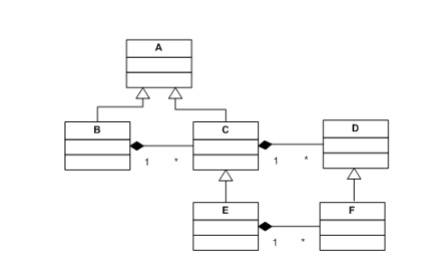

# Notes for test

## Verification and Validation

- **Verification** - confirms software works according to the specification
- **Validation** - confirms software is good for the end users

## UML semantics

- B **is a** A
- C **is part of** B

## Coupling and Cohesion

Low coupling and high cohesion is what we want.

## Black-box testing

- Code is hidden
- Tests derived from the software spec
- you use boundary test cases to test the software (testing days in a month in the year for January use test cases 0,1,31,32)
- uses partitioning

## White-box testing

Also known as Glass-box testing.

## Software Robustness

the more robust, the less chance the software will fail.

## Types of requirements

- **Functional Requirements:**
   - Services system should provide/required to do
   - how system reacts to particular inputs
   - how system should behave in particular situations
- **Non-Functional Requirements:**
   - Constraints on the system
   - standards to be used

## Evolutionary Development

You develop a prototype for users to test then use the data from tests to plan the next generation of the software.

- Not suitable for safety critical systems
- Usually used when a legacy system is already in place

## Natural language

- Easy for users who aren't technical to understand system requirements
- Can introduce ambiguity into specified Requirements

## Bell-LaPadula

Describes security requirements of the system

### Levels

0. Cant read anything, only write
1. Unclassified
2. Sensitive
3. Secret
4. Top-Secret

### Types of restrictions

- No Read-Up - A subject cannot read a document above their clearance level.
- No Write-Down - A document cannot be copied/included in another document with lower security clearance.
- Trusted Subjects:
   - Can write documents down.
   - Must be shown trustworthy with regard to the security policy.
